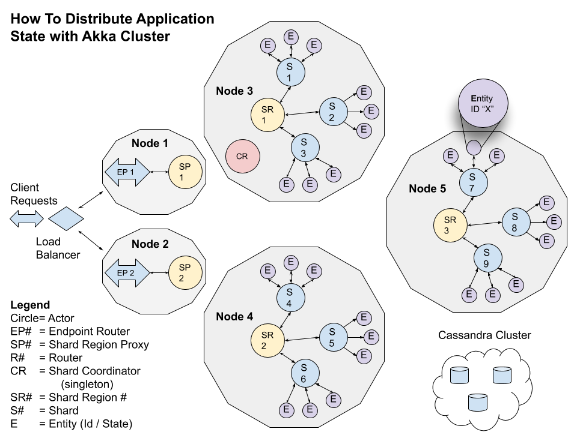

# How To Distribute Application State with Akka Cluster

Building, testing, containerizing, deploying, and monitoring distributed microservices is difficult, but using Lightbend technologies can make it a lot faster and easier to be successful.
In this four part blog series, we walk you through a working Proof of Concept (PoC) built using Lightbend’s open source distributed toolkit, Akka. This PoC delivers a resilient, highly performant, elastic, distributed, and consistent state solution that provides an automatic in memory cache with a persistent backing. Here is the breakdown:
- [Part 1](https://www.lightbend.com/blog/how-to-distribute-application-state-with-akka-cluster-part-1-getting-started) - Getting Started: we walk through building, testing, and running the PoC locally, with instrumentation and monitoring wired in from the very beginning using Lightbend Telemetry. 
- [Part 2](https://www.lightbend.com/blog/how-to-distribute-application-state-with-akka-cluster-part-2-docker-and-local-deploy) - Docker and Local Deploy: here we cover containerizing our PoC, and then deploying locally in Docker. Then, we’ll load test and monitor our PoC as we did in the first installment.
- [Part 3](https://www.lightbend.com/blog/how-to-distribute-application-state-with-akka-cluster-part-3-kubernetes-monitoring) - Kubernetes and Monitoring: in this part,we introduce Lightbend Console for Kubernetes (K8s), and then deploy our PoC in Minikube (desktop version of K8s) using YAML files provided in this repository. Again, we’ll load test with Gatling, but this time we’ll monitor our PoC in Lightbend Console.
- [Part 4](https://www.lightbend.com/blog/how-to-distribute-application-state-with-akka-cluster-part-4-the-source-code) - Source Code: In our final installment, we do a deep dive into our Scala source code.
> Note: This repoistory is written for **Scala** developers, a **Java** version  can be found [here](https://github.com/michael-read/akka-typed-distributed-state-blog-java). 	
----------------
## Update October 11, 2022
- Using a snapshot build of Akka 2.7 due to a bug in Common Journal Replicated Event Sourcing. We'll need to wait for the 2.7 release to run properly.
- The R2DBC snapshot plugin only ever keeps *one* snapshot per persistence id in the database.
  If a `keepNSnapshots > 1` is specified for an `EventSourcedBehavior` that setting will be ignored.
- The reason for this is that there is no real benefit to keep multiple snapshots around on a relational database with a high consistency.

## Update September 20, 2022
- updated the branch `mread-multi-dc-common-journal`, which supports Akka's Replicated Event Sourcing "Common Journal" running on Multi-Data Center / Microk8s and Yugabyte. README.md can be found [here](./microk8s-multi-dc/README.md).

## Update September 15, 2022
- update Akka related dependencies to latest
- Moved to Java 17 base image
- Set up for Akka DNS cluster formation on Docker w/ Yugabyte. Doc [here](DOCKER_DNS_YUGABYTE.md).
 
## Update: April 18, 2022
- Updated Akka, Akka Http, and Akka gRPC dependencies with the latest versions
- recreated the missing gRPC Client (ArtifactStateForEach) example for request / response

## Update: February 22, 2022
- Merged PR to include gRPC support even though blog hasn't been updated yet. No ETA on blog update.
- This repo written in Java can be found [here](https://github.com/michael-read/akka-typed-distributed-state-blog-java).

## Update: August 31, 2021
- On Branch: mread-add-grpc-endpoint: updated the instructions for deploying locally on Microk8s.

## Update: August 11, 2021
- On Branch: mread-add-grpc-endpoint, which will be merged to master, once we update the blog post
- fix Cassandra v3.11.11 docker-compose files

## Update: August 6, 2021
- fixed deprecation warnings

## Update: August 5, 2021
- Upgraded all versions of the Lightbend stack's dependencies to the currently released versions.
  * The biggest change revolves around the change of the `akka-persistence-cassandra` (v0.102 -> v1.0.5), which requires a migration in tables and configuration.
  * Scala: v2.13.1 -> v2.13.6
  * Sbt v1.3.9 -> v1.5.5    
  * Akka: v2.6.6 -> v2.6.15
  * Akka Http: v10.1.12 -> v10.2.5
  * Akka Management v1.0.8 -> v1.1.1
  * Lightbend Telemetry -> v2.14.0 -> v2.16.1
  * Java: v8 -> v11    
    
- Microk8s - tested locally on Microk8s, please see [microk8s/README.md](microk8s/README.md) for more information.
- locked in to cassandra image to: v3.11.11

## Update: June 10, 2020

In honor of Lightbend’s release of Akka’s Split Brain Resolver as OSS, I’ve updated this repository to take advantage of Akka 2.6.6.

For more information on Akka Split Brain Resolver please see the announcement here → https://akka.io/blog/news/2020/06/08/akka-2.6.6-released-split-brain-resolver

Also, Patrik Nordwall’s video on Split Brain Resolver is really great in helping you understand why you should care → https://akka.io/blog/news/2020/06/08/akka-split-brain-resolver-video